### ソケットのはんだ付け
PCBの裏面に、ソケットをはんだ付けします。
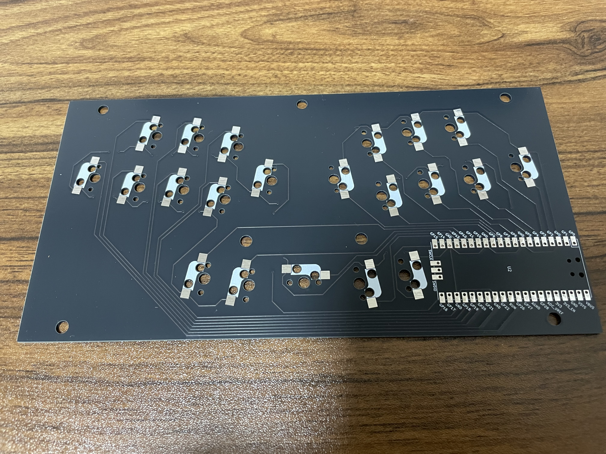

### MCUのはんだ付け
３つの角を仮止め（図はピンヘッダを１つ折って使用している）して、もう１つの角をはんだ付けします。

１つの角（図では右下）をはんだ付けできたら、同様にほかの角もはんだ付けします。

４つの角だけはんだ付けできた状態。

四隅からちょっとずつはんだ付けしていきます。

すべてはんだ付けできた状態。

### 静音シートの貼り付け（任意）
PCBの表面に、シートを貼っていきます。（図は右端に１つ貼った状態）

穴の部分を合わせて貼っていきます。

シートをすべて貼った状態。（右下１つはすでに静音フォームも貼った状態）

### 静音フォームの貼り付け（任意）
スイッチ間の距離がほとんどないため、静音フォームの４辺のうち１辺をカットしている箇所がほとんどです。また、スタビライザーを使用するスイッチには使用していません。その代わり、フォームを使用できないスイッチには、隣のスイッチのフォームが触れる状態にしたいため、その辺はカットしないようにしています。

### スタビライザーの加工・取り付け
人差し指側の２つは、前部分が接触し、キーの動きが悪くなるのでカットします。（カットしても多少はキーの重たさが増すかもしれません）
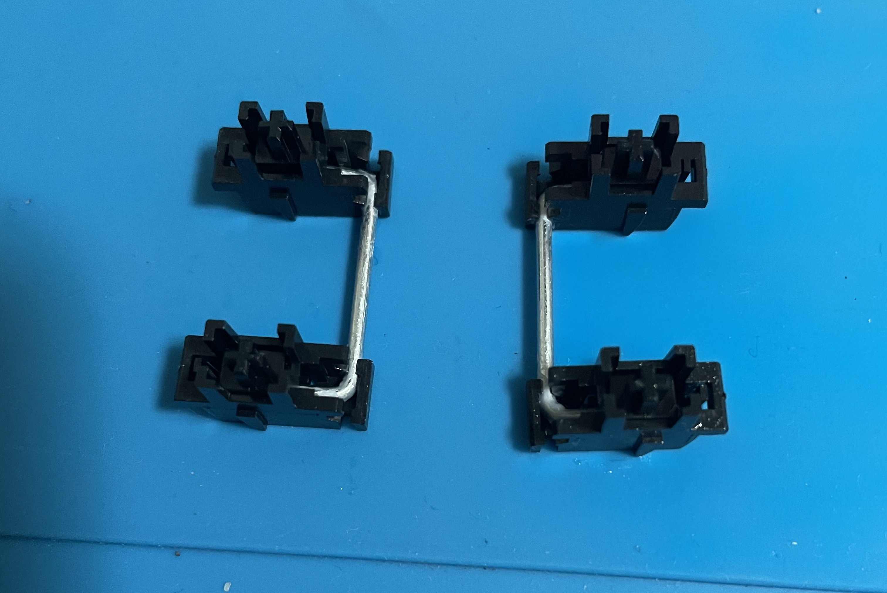
ニッパーで前部分をカットした状態。
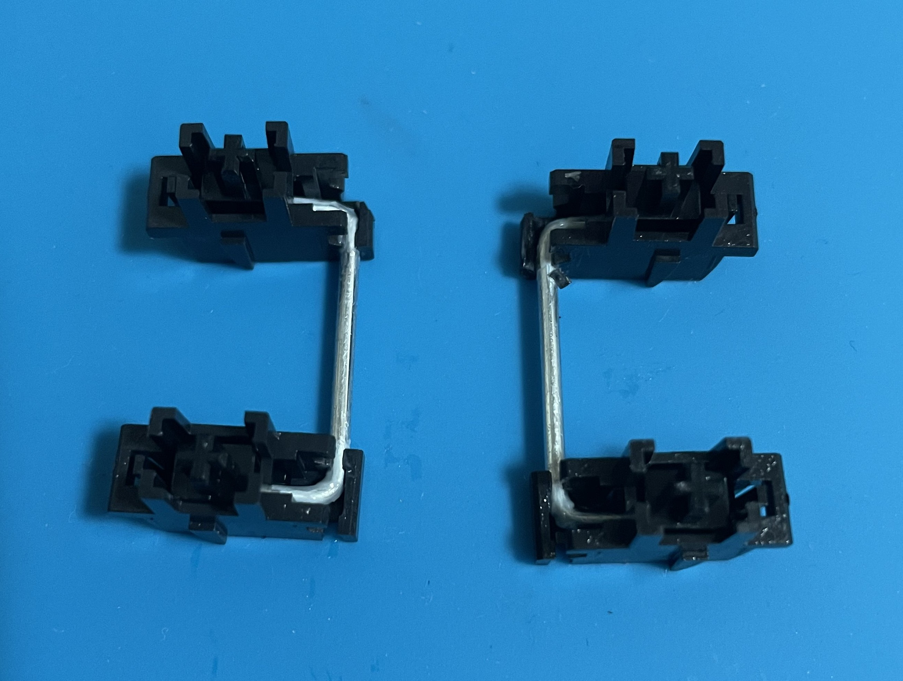
４つのスタビライザーを取り付けます。
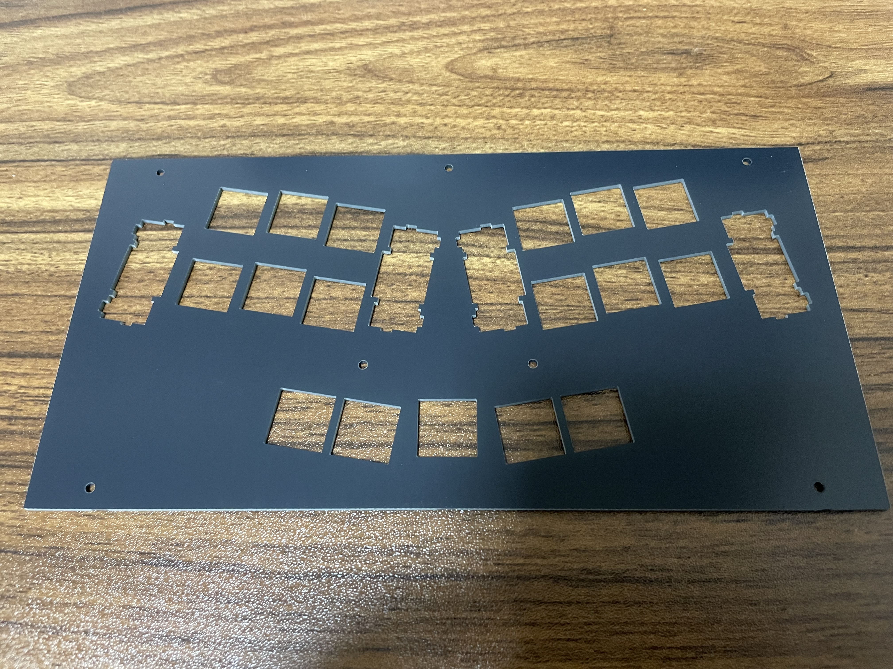
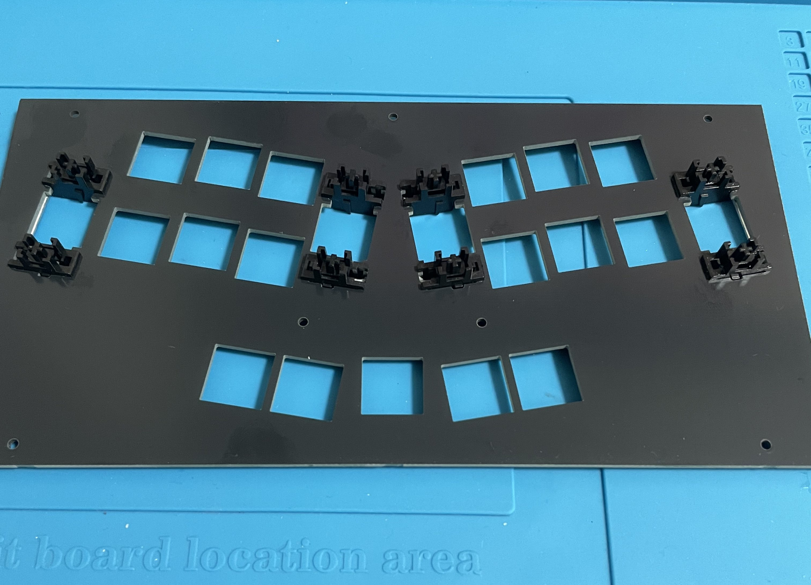
### スイッチの取り付け
PCBの表面の上にスイッチプレートを重ね、その上からスイッチを差し込んでいきます。最初にいちばん外側と内側、スタビライザーのある箇所から差し込むとやりやすいと思います。あまり強く差し込もうとすると、ソケットの穴とずれている場合、スイッチのピンが曲がってしまいますので、慎重さが必要です。
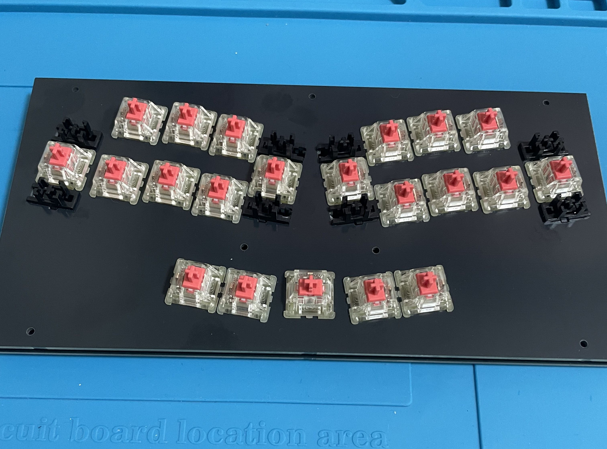
### キーキャップの取り付け
下のキー４つ（中央のキー除く）と、内側のキー６つ（片側で長いキー１つ、短いキー２つ）は、キーの間隔を縮めるため、スイッチに差し込む軸の部分が中心より１mmずれています。それぞれが近づくように、キャップの軸のずれている側を確認しながら差し込みます。
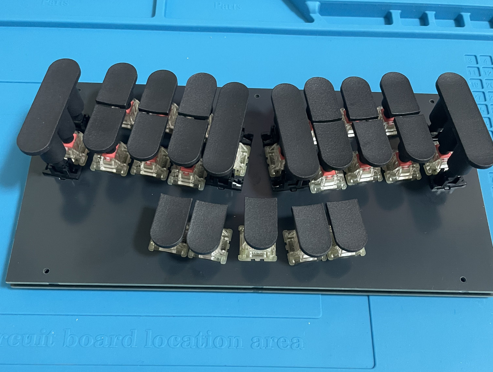

### スペーサーの取り付け
ケースの底側からねじを締め、スペーサーをケースに取り付けます。
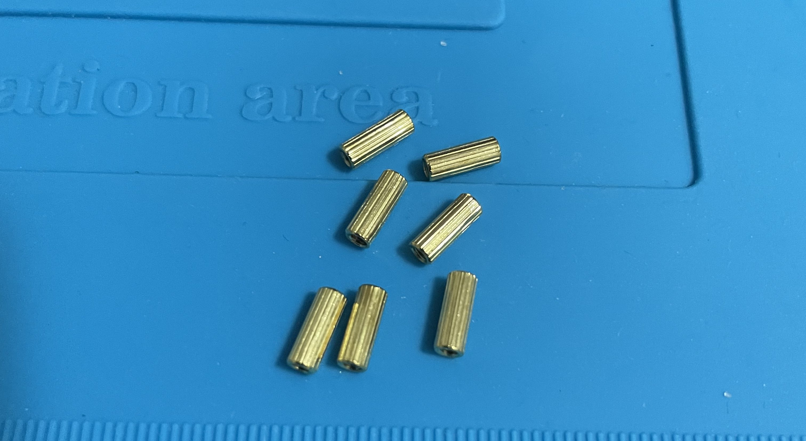
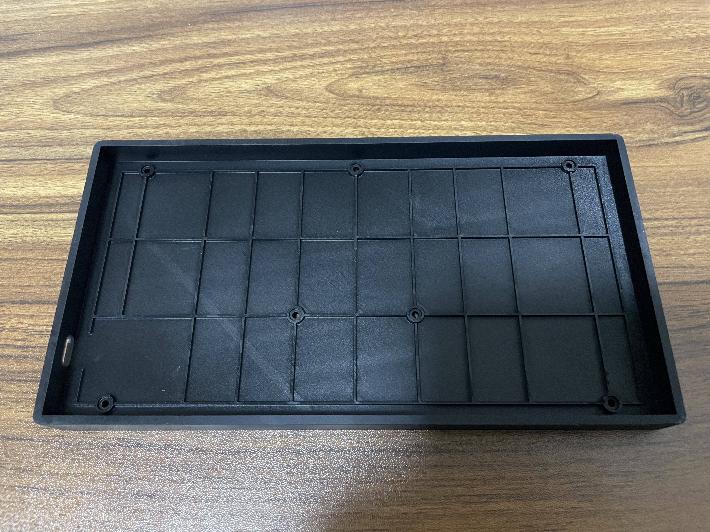
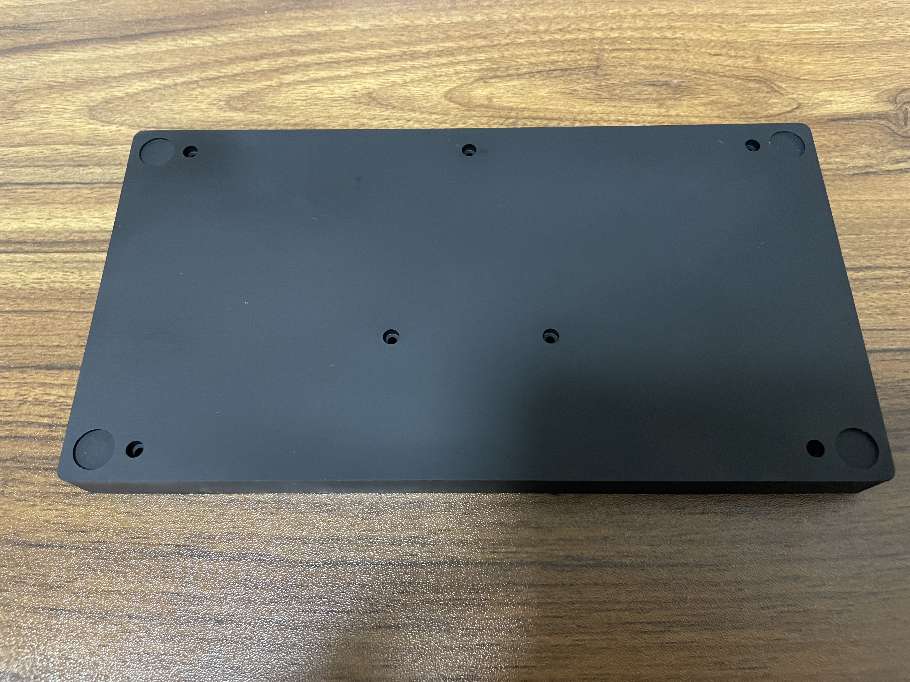
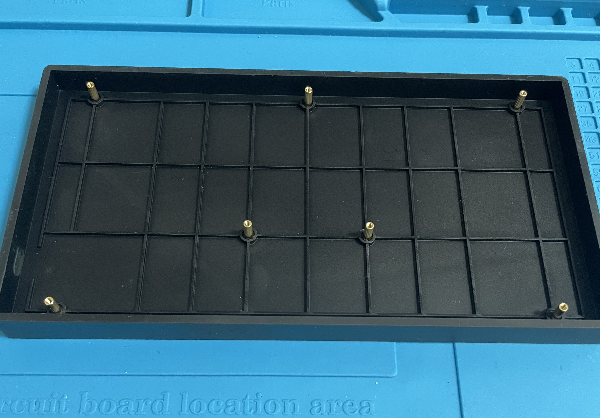
### 完成

