### ソケットのはんだ付け
PCBの裏面に、ソケットをはんだ付けします。

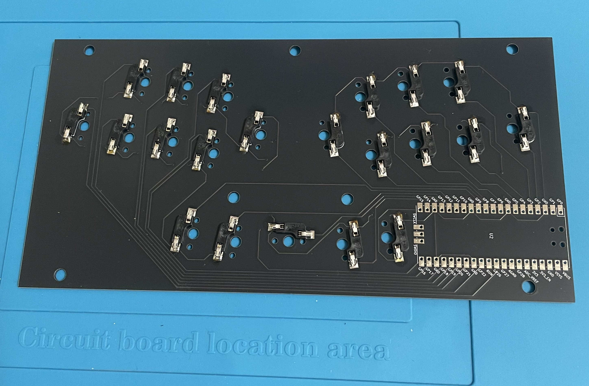
### MCUのはんだ付け
３つの角を仮止め（図はピンヘッダを１つ折って使用している）して、もう１つの角をはんだ付けします。
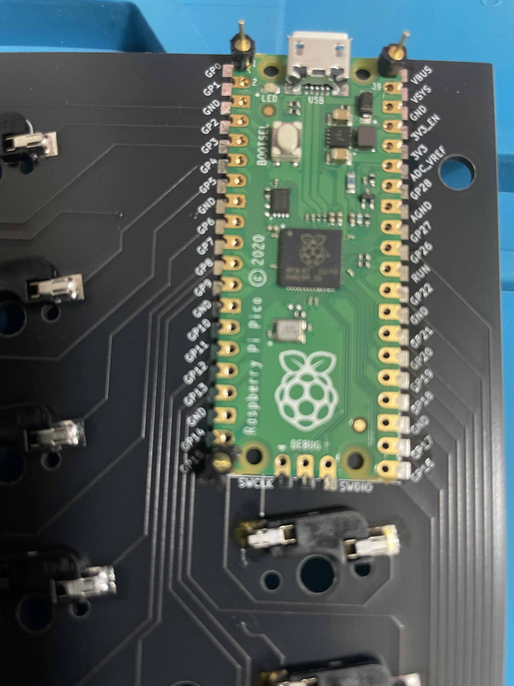
１つの角（図では右下）をはんだ付けできたら、同様にほかの角もはんだ付けします。
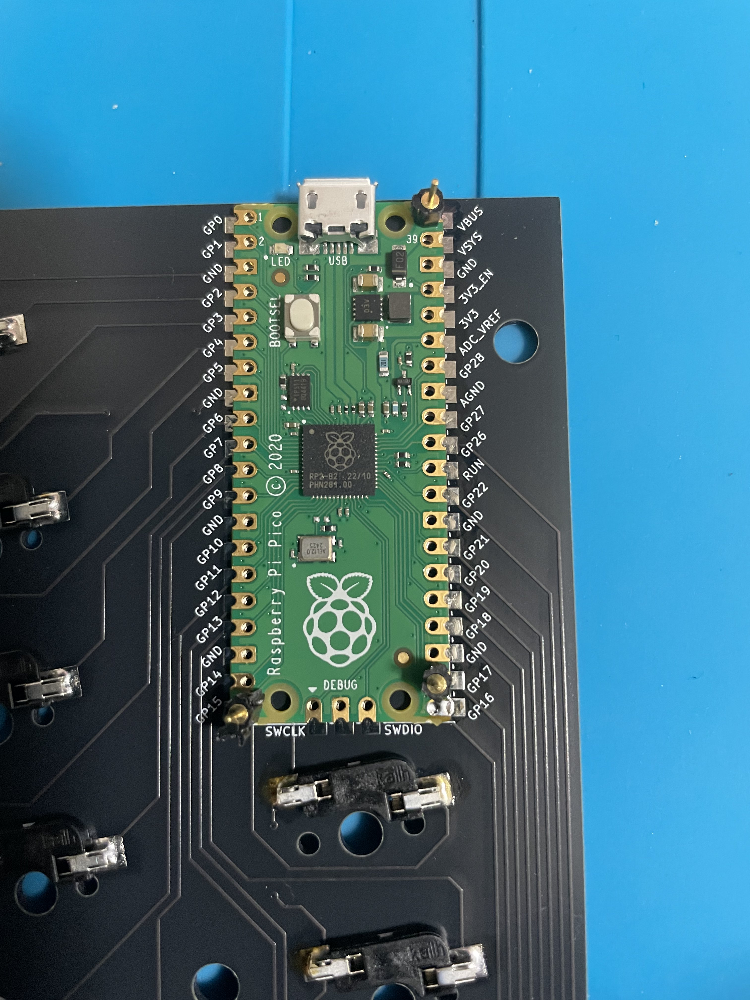
４つの角だけはんだ付けできた状態。
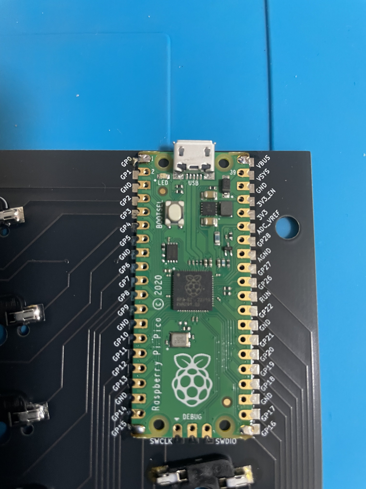
四隅からちょっとずつはんだ付けしていきます。
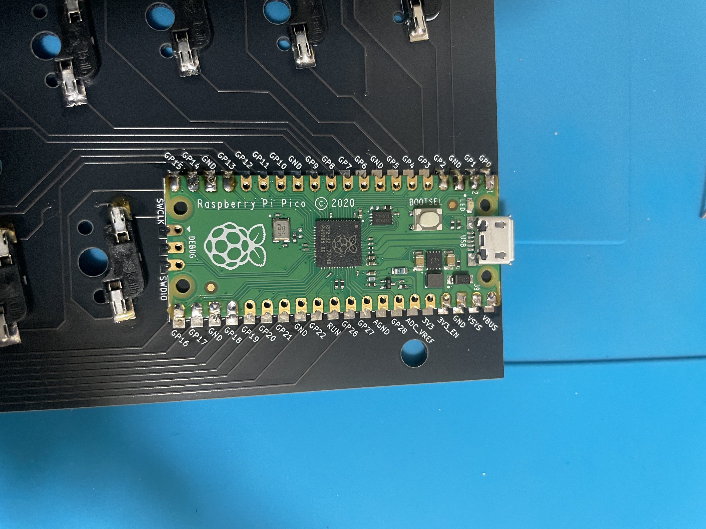
すべてはんだ付けできた状態。
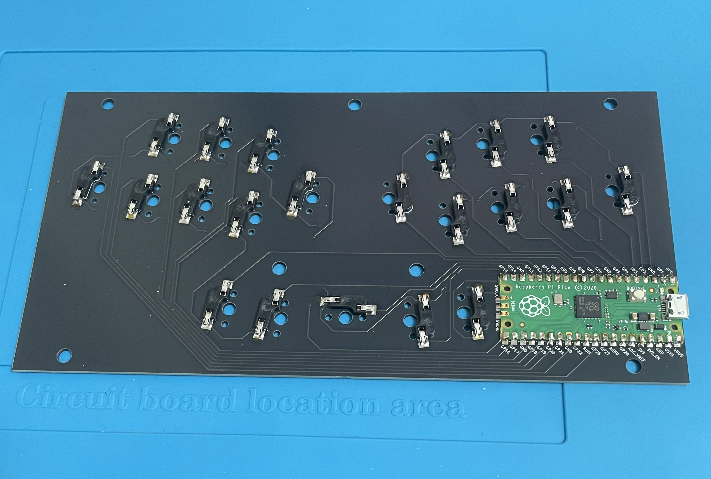
### 静音シートの貼り付け（任意）
PCBの表面に、シートを貼っていきます。（図は右端に１つ貼った状態）
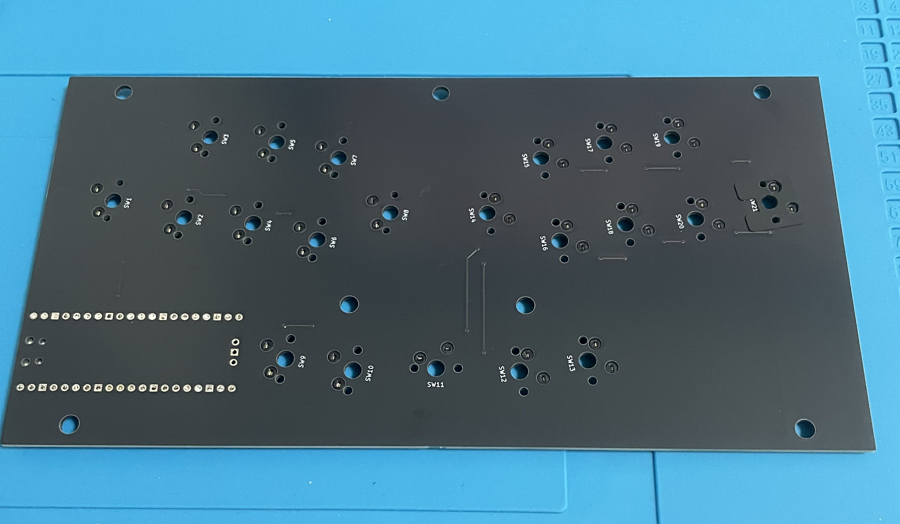
穴の部分を合わせて貼っていきます。
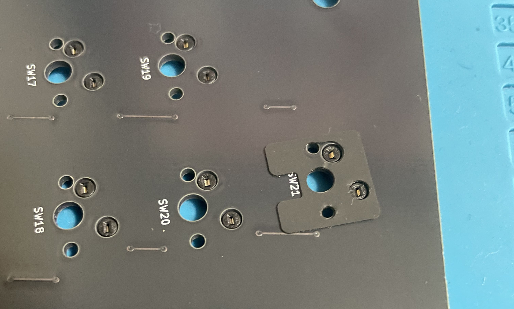
シートをすべて貼った状態。（右下１つはすでに静音フォームも貼った状態）
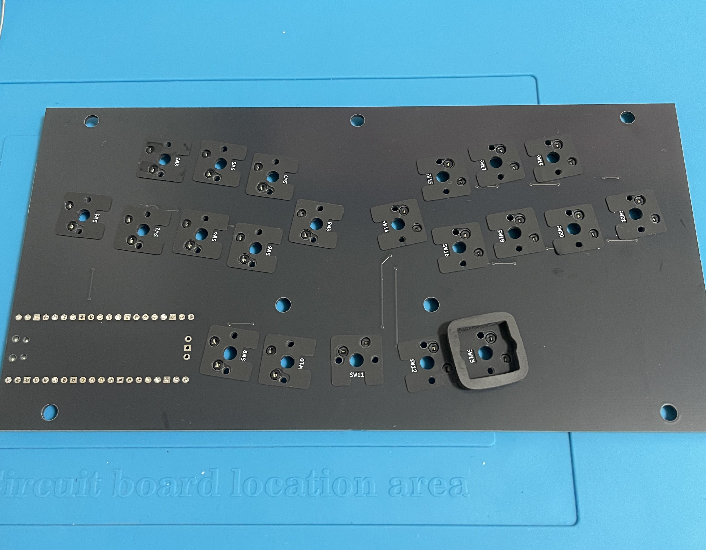
### 静音フォームの貼り付け（任意）
スイッチ間の距離がほとんどないため、静音フォームの４辺のうち１辺をカットしている箇所がほとんどです。また、スタビライザーを使用するスイッチには使用していません。その代わり、フォームを使用できないスイッチには、隣のスイッチのフォームが触れる状態にしたいため、その辺はカットしないようにしています。
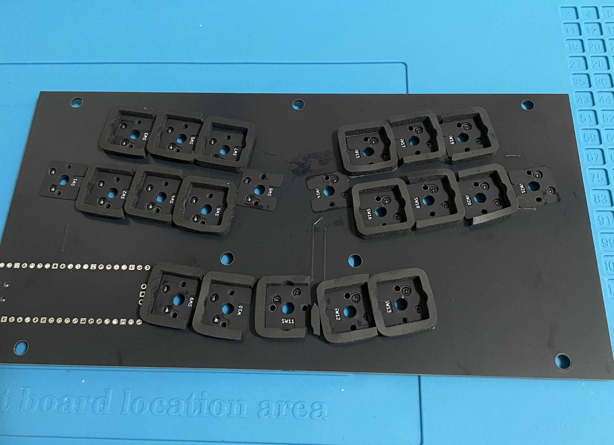

### 完成
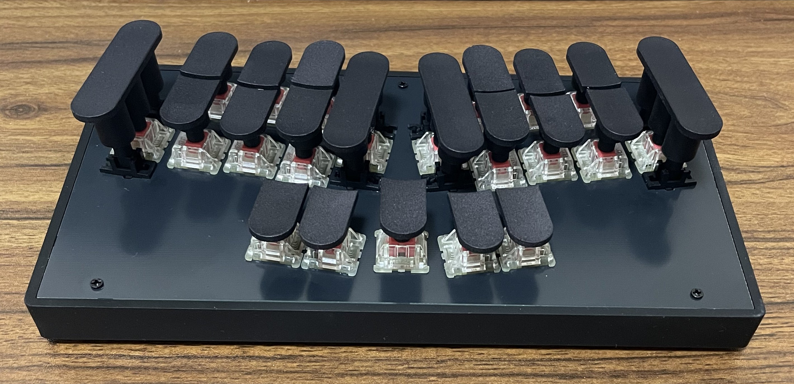
